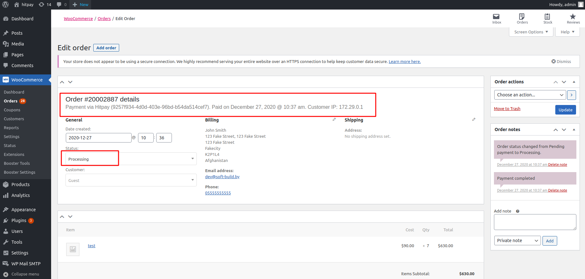

# HitPay 

## Installing

1. Need to download the repository and upload to wp shop
2. Go to admin page:

3. Click on Activate button

## Configuration
1. Go to woocommerce configuration page:

2. Go to dashboard of hitpay:

3. If you don't have the client keys, need to create they

4. Copy api key and salt from hitpay dashboard to woocommerce module in the same named fields

## Using

1. Payment

2. Checking orders
